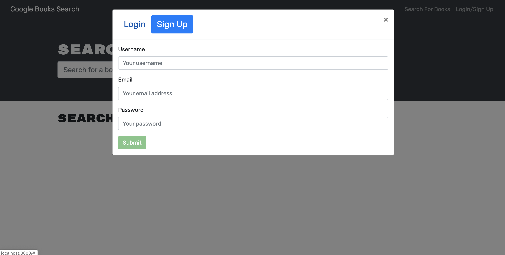
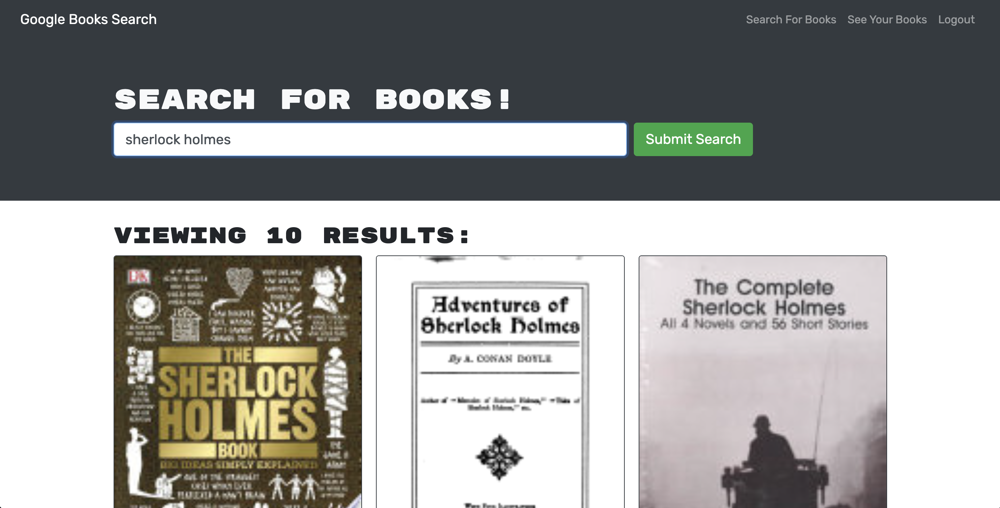
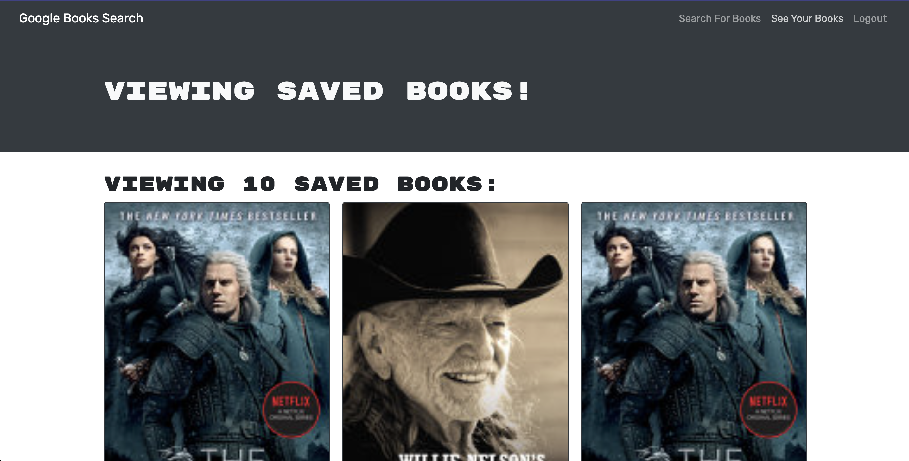

# 🏗️ Book Search Engine

Link :

## Description 📖

The app is a Google Books API search engine built with a GraphQL API with Apollo Server.

## Features 📝

The app was built using the MERN stack with a React front end, MongoDB database, and Node.js/Express.js server and API.

## Screenshots 📷 :

* User presented with login or sign up window:

  
  
* User can search for books and save them:

  

* User can view their saved books:

  
  

## Takeaways 💡

I learned to set up an Apollo Server to use GraphQL queries and mutations to fetch and modify data, refactoring an existing RESTful API.

I leanred to modify the existing authentication middleware so that it works in the context of a GraphQL API.

I learned to create an Apollo Provider so that requests can communicate with an Apollo Server.

----
© 2022 Caswell Orr. Confidential and Proprietary. All Rights Reserved.